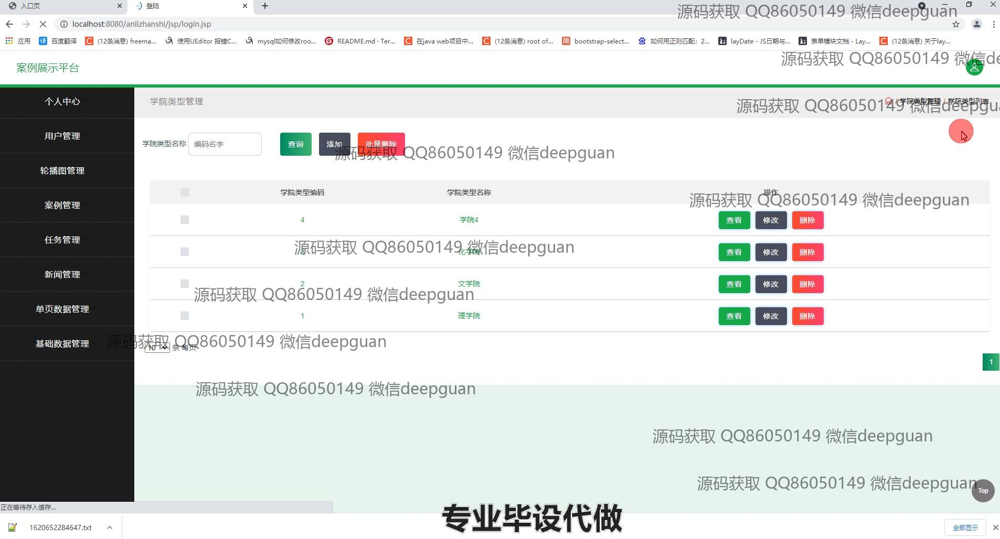
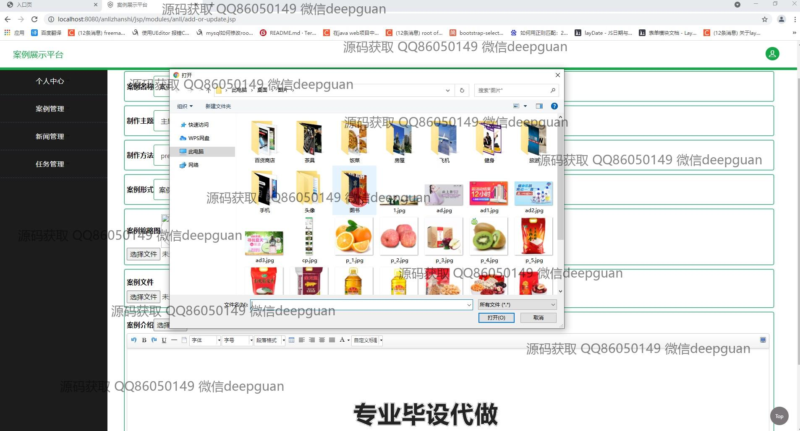

<h1 align="center">课程案例库平台的设计与实现</h1>

## 简介
课程案例库平台：角色分为管理员、用户，主要功能包括用户管理、案例管理、任务管理和新闻管理，用户可以编辑、查询和管理各类信息，支持文件上传和权限设置。    --计算机毕业设计源码；毕设源码；java毕业设计源码

## 联系方式

<h3 align="center">获取完整代码与数据库文件 + 微信：deepguan QQ: 86050149 QQ群: 783742310</h3>

<h3 align="center">可帮忙远程部署 包运行成功！提供远程部署、修改代码、设计文档指导、代码讲解等服务！</h3>

## 功能介绍（完整见运行截图）
管理员：基本功能包括登录、角色切换、个人信息管理，并可以通过用户管理功能编辑用户信息，如账户、编号、姓名和权限设定。管理员可以在案例管理功能中对案例进行增删查改，上传文件以及编辑案例内容。任务管理允许管理员查看、编辑任务信息，上传附件以及管理详细任务说明。新闻管理页面中，管理员可以编辑新闻内容和类型。平台还具有学院类型和单页数据管理功能，支持编辑、批量删除及数据筛选。

用户：用户可通过登录功能进行身份验证，进入系统后可以浏览和管理个人信息。用户管理功能允许用户查看和编辑其信息，如关联学院和年级等。通过案例管理模块，用户可以搜索和浏览案例，查看详情或上传新案例。任务管理让用户可以输入任务名称、类型及上传任务附件，使用富文本编辑器输入任务详情。同时，用户可通过平台提供的搜索功能快速定位所需信息。

## 运行截图

本代码来源于网络,仅供学习参考使用!

